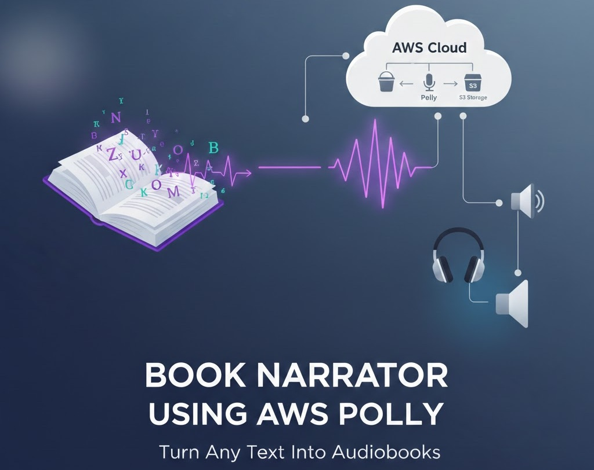
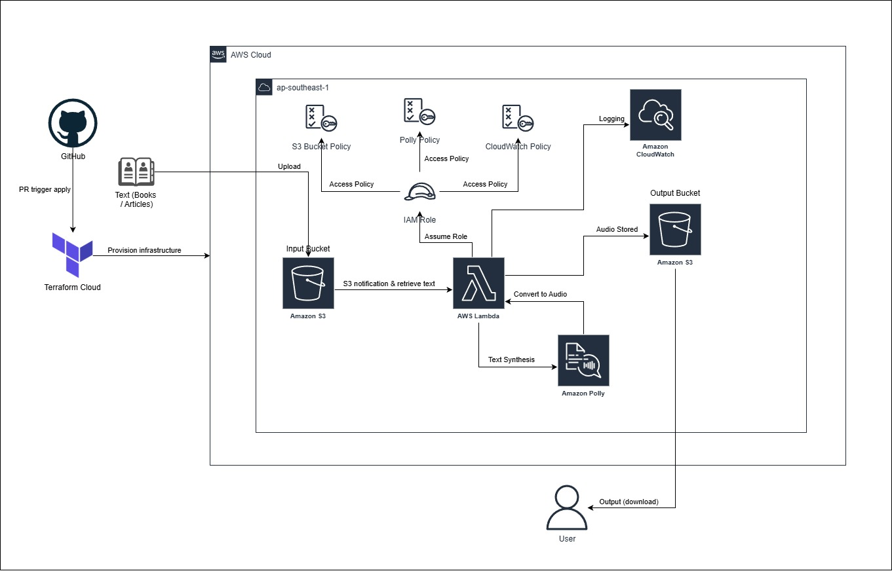
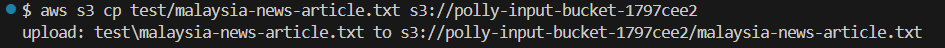
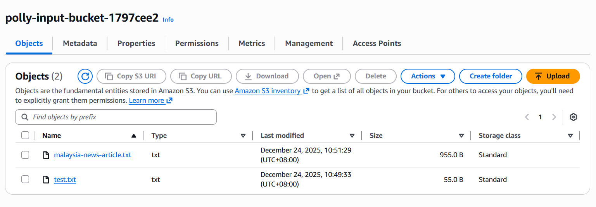
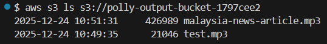
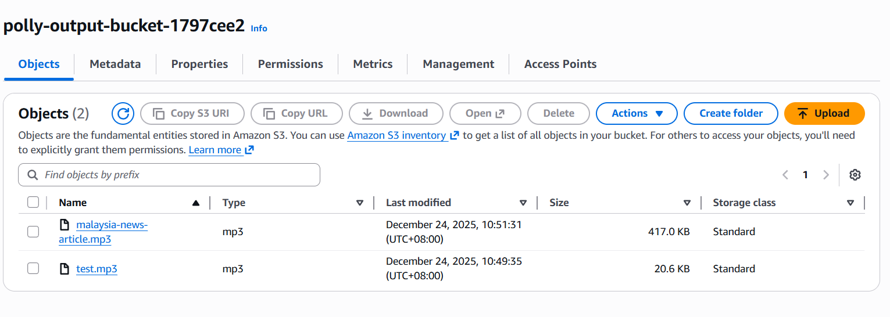
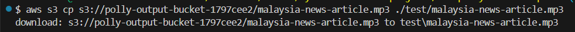
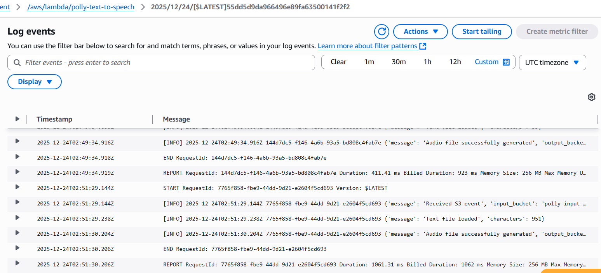

[![Contributors][contributors-shield]][contributors-url]
[![Forks][forks-shield]][forks-url]
[![Stargazers][stars-shield]][stars-url]
[![Issues][issues-shield]][issues-url]
[![Unlicense License][license-shield]][license-url]
[![LinkedIn][linkedin-shield]][linkedin-url]

  <h1>🗣️ AWS Polly Text-to-Speech</h1>
  

     
    <a target="_blank" href="https://ShenLoong99.github.io/my-terraform-aws-projects-2025/AWS-polly-text-to-speech/audio/
    ">🎵 [Click here to listen to the intro]</a>
  

  
The <strong>AWS Polly Text-to-Speech</strong> project is a serverless cloud solution that converts text files stored in S3 into natural-sounding speech. Leveraging Amazon Polly, this application allows users to automatically generate audio from blogs, newsletters, scripts, or any text content.

 

 
[![Infrastructure CI][ci-shield]][ci-url]
[![Production Deployment][cd-shield]][cd-url]
[![Update Documentation][docs-shield]][docs-url]

 

<a href="#about-the-project"><strong>Explore the docs »</strong></a>

  
Table of Contents

  <ol>
    <li><a href="#about-the-project">About The Project</a></li>
      <li><a href="#built-with">Built With</a></li>
      <li><a href="#use-cases">Use Cases</a></li>
      <li><a href="#architecture">Architecture</a></li>
      <li><a href="#file-structure">File Structure</a></li>
      <li><a href="#technical">Technical Reference</a></li>
      <li><a href="#getting-started">Getting Started</a></li>
      <li><a href="#gitops">GitOps & CI/CD Workflow</a></li>
      <li><a href="#usage">Usage</a></li>
      <li><a href="#roadmap">Roadmap</a></li>
      <li><a href="#challenges-faced">Challenges</a></li>
      <li><a href="#cost-optimization">Cost Optimization</a></li>
      <li><a href="#acknowledgements">Acknowledgements</a></li>
  </ol>

<h2 id="about-the-project">About The Project</h2>

    This project demonstrates the power of <strong>serverless AWS architecture</strong> and <strong>Infrastructure as Code (IaC)</strong> with Terraform. Text files uploaded to an S3 bucket are automatically processed by a Lambda function that calls Amazon Polly to generate MP3 audio files. This automated pipeline enhances accessibility, user engagement, and content distribution workflows.

  <strong>Notice:</strong> This project has been migrated from a monolithic collection at <a href="https://github.com/ShenLoong99/my-terraform-aws-projects-2025">my-terraform-aws-projects-2025</a> to this dedicated repository for better project isolation and CI/CD management. 
  To review the full development lifecycle, including initial architectural decisions and incremental code changes, please refer to the original commit history in the source repository.

<a href="#readme-top">↑ Back to Top</a>

<h2 id="built-with">Built With</h2>

  
  
  
  
  

<ul>
  <li><strong>Terraform:</strong> Provision and manage AWS infrastructure (S3 buckets, IAM roles, Lambda) via IaC.</li>
  <li><strong>AWS S3:</strong> Secure object storage for input text files and output audio.</li>
  <li><strong>Amazon Polly:</strong> Converts text into high-quality speech.</li>
  <li><strong>AWS IAM:</strong> Implements least-privilege access for Lambda to interact with S3 and Polly.</li>
  <li><strong>Python (Boto3):</strong> Handles S3 events, Polly API calls, and audio file storage.</li>
</ul>

<a href="#readme-top">↑ Back to Top</a>

<h2 id="use-cases">Use Cases</h2>
<ul>
    <li><strong>Content Accessibility:</strong> Automatically generate audio versions of blog posts or newsletters.</li>
    <li><strong>Learning & Education:</strong> Convert textbooks or study materials into narrated audio for auditory learners.</li>
    <li><strong>Podcast & Media Automation:</strong> Quickly produce spoken content from written scripts.</li>
    <li><strong>Voice Assistants:</strong> Backend engine for applications that read content aloud on demand.</li>
</ul>

<a href="#readme-top">↑ Back to Top</a>

<h2 id="architecture">Architecture</h2>

  

  The serverless architecture is designed for simplicity, scalability, and cost-efficiency:

<ol>
  <li><strong>Input Layer:</strong> Users upload text files (articles, scripts, newsletters) to the input S3 bucket.</li>
  <li><strong>Processing Layer:</strong> A Lambda function is triggered by S3 events. It reads the text and calls Amazon Polly to synthesize speech.</li>
  <li><strong>Identity & Security:</strong> IAM role grants the Lambda permission to access the buckets and invoke Polly with least privilege.</li>
  <li><strong>Output Layer:</strong> Generated MP3 files are saved to the output S3 bucket. Optional lifecycle rules and encryption ensure cost savings and security.</li>
  <li><strong>CloudWatch Logs:</strong> Captures detailed Lambda execution logs for monitoring, debugging, and verifying Polly TTS output.</li>
</ol>

<a href="#readme-top">↑ Back to Top</a>

<h2 id="file-structure">File Structure</h2>
<pre>aws-terraform-polly-text-to-speech/
├── .terraform/               # Terraform internal working directory (auto-generated)
├── .github/
│   └── workflows/            # CI/CD Pipeline Definitions
│       ├── cd.yml            # Production Deployment (OIDC + S3 Sync)
│       ├── ci.yml            # Terraform PR Insights (Checkov, TFLint, Plan)
│       └── documentation.yml # Automated Documentation Sync via terraform-docs
├── assets/                   # Documentation images and UI design icons
├── audio/                    # Output audio files generated by AWS Polly
│   └── index.html            # GitHub Pages demo page to preview generated audio
├── modules/                  # Child Modules (Stateless Logic)
│   ├── iam/                  # Least-privilege Roles & Policies
│   ├── storage/              # S3 Buckets for static hosting
│   └── lambda/               # Polly Lambda Compute & Trigger setup
│       └── lambda/           # Serverless backend logic
│           ├── handler.py    # Lambda Python source code
│           └── function.zip  # Compiled deployment artifact
│       ├── main.tf           # Module-specific resources
│       ├── outputs.tf        # Values exported to the root
│       ├── providers.tf      # Version constraints (No cloud block!)
│       └── variables.tf      # Module inputs
├── scripts/                  # Automation & Validation Scripts
│   └── test-polly.sh         # Post-deployment integration test
├── text/                     # Sample input text files uploaded to S3
├── .gitignore                # Git ignored files (e.g. .terraform/, state files)
├── main.tf                   # Provider & Random ID configurations
├── outputs.tf                # CloudFront and API Gateway URLs for the user
├── providers.tf              # Terraform Cloud backend & version constraints
├── variables.tf              # Configurable project inputs (AWS Region, Tags)
├── .pre-commit-config.yaml   # Local git-hook orchestration
├── .tflint.hcl               # TFLint AWS ruleset configuration
├── .checkov.yml              # Checkov scan ignore list
├── .terraform-docs.yml       # Config for terraform documentation during workflow
├── terraform.tfstate         # Local state file (if not using cloud)
├── terraform.tfstate.backup  # Previous state snapshot
├── README.template.md        # Documentation source template
└── README.md                 # Project documentation (Auto-injected by terraform-docs)
</pre>

<a href="#readme-top">↑ Back to Top</a>

<h2 id="technical">Technical Reference</h2>
This section is automatically updated with the latest infrastructure details.

<b>Detailed Infrastructure Specifications</b>

<!-- BEGIN_TF_DOCS -->

## Requirements

| Name                                                                     | Version |
| ------------------------------------------------------------------------ | ------- |
|  [terraform](#requirement_terraform) | >= 1.5  |
|  [archive](#requirement_archive)       | ~> 2.0  |
|  [aws](#requirement_aws)                   | ~> 5.0  |
|  [random](#requirement_random)          | ~> 3.0  |

## Modules

| Name                                                     | Source            | Version |
| -------------------------------------------------------- | ----------------- | ------- |
|  [iam](#module_iam)             | ./modules/iam     | n/a     |
|  [lambda](#module_lambda)    | ./modules/lambda  | n/a     |
|  [storage](#module_storage) | ./modules/storage | n/a     |

## Resources

| Name                                                                                                                                          | Type     |
| --------------------------------------------------------------------------------------------------------------------------------------------- | -------- |
| [aws_cloudwatch_log_group.lambda_log_group](https://registry.terraform.io/providers/hashicorp/aws/latest/docs/resources/cloudwatch_log_group) | resource |

## Inputs

| Name                                                            | Description                    | Type     | Default            | Required |
| --------------------------------------------------------------- | ------------------------------ | -------- | ------------------ | :------: |
|  [aws_region](#input_aws_region) | AWS region to deploy resources | `string` | `"ap-southeast-1"` |    no    |

## Outputs

| Name                                                                                            | Description                          |
| ----------------------------------------------------------------------------------------------- | ------------------------------------ |
|  [aws_region](#output_aws_region)                               | AWS region to deploy resources       |
|  [input_bucket_name](#output_input_bucket_name)          | S3 bucket for uploading text files   |
|  [lambda_function_name](#output_lambda_function_name) | Text-to-Speech Lambda function       |
|  [output_bucket_name](#output_output_bucket_name)       | S3 bucket where MP3 files are stored |

<!-- END_TF_DOCS -->

<a href="#readme-top">↑ Back to Top</a>

<h2 id="getting-started">Getting Started</h2>
<h3>Prerequisites</h3>
<ul>
    <li>Active <strong>AWS account</strong> with S3, Lambda, and Polly access.</li>
    <li><strong>Terraform CLI / Terraform Cloud(optional)</strong> for IaC deployment.</li>
    <li><strong>Python 3.x</strong> installed locally for testing Lambda code.</li>
    <li><strong>Set your AWS Region:</strong> Set to whatever <code>aws_region</code> you want in <code>variables.tf</code>.</li>
</ul>

<h3>Terraform Cloud State Management</h3>
<ol>
   <li>Create a new <strong>Workspace</strong> with github version control workflow in Terraform Cloud.</li>
   <li>In the Variables tab, add the following <strong>Terraform Variables:</strong>
   </li>
   <li>
    Add the following <strong>Environment Variables</strong> (AWS Credentials):
    <ul>
      <li><code>AWS_ACCESS_KEY_ID</code></li>
      <li><code>AWS_SECRET_ACCESS_KEY</code></li>
   </ul>
   </li>
    <li>
      Run the command ni Terraform CLI:
      <pre>terraform login</pre>
    </li>
    <li>Create a token and follow the steps in browser to complete the Terraform Cloud Connection.</li>
    <li>
      Add the <code>backend</code> block in <code>terraform</code> code block</code>:
    <pre>backend "remote" {
  hostname     = "app.terraform.io"
  organization = &lt;your-organization-name&gt;
  workspaces {
    name = &lt;your-workspace-name&gt;
  }
}</pre>
   </li>
    <li>
      Run the command in Terraform CLI to migrate the state into Terraform Cloud:
      <pre>terraform init -migrate-state</pre>
    </li>
</ol>

<h3>Installation & Deployment</h3>
<ol>
    <li>
        <strong>Clone the Repository:</strong>
        <pre>git clone https://github.com/ShenLoong99/aws-terraform-polly-text-to-speech.git</pre>
    </li>
    <li>
        <strong>Provision Infrastructure:</strong> 
        <strong>Terraform Cloud</strong> → <strong>Initialize & Apply:</strong> Push your code to GitHub. Terraform Cloud will automatically detect the change, run a <code>plan</code>, and apply automatically (TFC CLI workflow).
    </li>
    <li>
        <strong>Observe workflow:</strong> 
        <strong>GitHub (GitOps)</strong> → <strong>Github actions:</strong> Observe the process/workflow of CI/CD in the actions tab in GitHub.
    </li>
</ol>

<a href="#readme-top">↑ Back to Top</a>

<h2 id="gitops">GitOps & CI/CD Workflow</h2>

This repository implements a "Hybrid" GitOps workflow where infrastructure changes are verified via Pull Requests and documentation is automatically kept in sync using a dedicated GitHub App to maintain branch integrity. The <strong>Pre-commit</strong> framework implements a "Shift-Left" strategy, ensuring that code is formatted, documented, and secure before it ever leaves your machine.

<h3>Workflow</h3>
<ol>
  <li>
    <strong>Branch Protection Rulesets</strong> 
    To ensure high code quality and prevent unauthorized changes to the production environment, the <code>main</code> branch is governed by a <strong>GitHub Branch Ruleset</strong>.
    <ul>
      <li><strong>Pull Request Mandatory:</strong> No code can be pushed directly to <code>main</code>. All changes must originate from a feature branch and be merged via a Pull Request.</li>
      <li><strong>Required Status Checks:</strong> The <code>Infrastructure CI</code> (Terraform Plan & Static Analysis) must pass successfully before a merge is permitted.</li>
      <li><strong>Bypass Authority:</strong> The dedicated GitHub App is added to the Bypass List with "Always allow" permissions. This allows the bot to push documentation updates directly to <code>main</code> without being blocked by PR requirements.</li>
    </ul>
  </li>
  <li>
    <strong>Pre-commit</strong>
    <ul>
      <li><strong>Tool:</strong> Executes <code>terraform fmt</code>, <code>terraform validate</code>, <code>TFLint</code>, <code>terraform_docs</code> and <code>checkov</code> to ensure the code is clean.</li>
      <li><strong>Trigger:</strong> Runs on every <strong>git commit</strong>.</li>
      <li>
        <strong>Outcome:</strong> If any check fails, the commit is blocked. You fix the error, re-add the file, and commit again.
      </li>
    </ul>
  </li>
  <li>
    <strong>Continuous Integration (PR)</strong>
    <ul>
      <li><strong>Tool:</strong> Executes <code>terraform fmt -check</code>, <code>terraform validate</code> and <code>checkov</code>, then do <code>plan</code> and cost estimation and print it on PR.</li>
      <li><strong>Trigger:</strong> Runs on every <strong>Pull Request</strong>.</li>
      <li>
        <strong>Outcome:</strong> This acts as the "Gatekeeper" before code is merged to <code>main</code>.
      </li>
    </ul>
  </li>
  <li>
    <strong>Continuous Delivery (Deployment)</strong>
    <ul>
      <li><strong>Tool:</strong> Terraform Cloud + GitHub Actions OIDC.</li>
      <li><strong>Trigger:</strong> Merges to the <code>main</code> branch.</li>
      <li>
        <strong>Outcome:</strong> The pipeline verifies the infrastructure state and runs a post-deployment health check with(<code>health-check.sh</code> & <code>smoke-test-website.sh</code>).
      </li>
    </ul>
  </li>
  <li>
    <strong>Dynamically update readme documentation</strong>
    <ul>
      <li><strong>Tool:</strong> <code>terraform_docs</code> + GitHub Actions.</li>
      <li><strong>Trigger:</strong> Merges to the <code>main</code> branch.</li>
      <li>
        <strong>Outcome:</strong> The pipeline verifies the infrastructure state from Terraform Cloud, retrieve outputs from Terraform Cloud and update the readme documentation file dynamically.
      </li>
    </ul>
  </li>
</ol>

<h3>Prerequisites for GitOps</h3>
<ul>
  <li><strong>Repository Secret <code>TF_API_TOKEN</code>:</strong> Required for GitHub to communicate with Terraform Cloud.</li>
  <li><strong>Trigger:</strong> A GitHub Actions OIDC role (<code>GitHubActionRole</code>) allows the runner to verify AWS resources without long-lived keys.</li>
  <li>
      <strong>Automated Documentation via GitHub App:</strong> Instead of using a Personal Access Token (PAT) or the default <code>GITHUB_TOKEN</code>, this project uses a custom <strong>GitHub App</strong> for automated tasks. 
      <table>
         <thead>
            <tr>
               <td>Secret</td>
               <td>Description</td>
               <td>Source</td>
            </tr>
         </thead>
         <tbody>
            <tr>
               <td><code>BOT_APP_ID</code></td>
               <td>The unique numerical ID assigned to your GitHub App.</td>
               <td>App Settings > General</td>
            </tr>
            <tr>
               <td><code>BOT_PRIVATE_KEY</code></td>
               <td>The full content of the generated <code>.pem</code> private key file.</td>
               <td>App Settings > Private keys</td>
            </tr>
         </tbody>
      </table>
   </li>
</ul>

<a href="#readme-top">↑ Back to Top</a>

<h2 id="usage">Usage & Testing</h2>
<ol>
  <li>
    Upload a text file (e.g., <code>malaysia-news-article.txt</code>) to the input S3 bucket created by Terraform. 
    <pre>aws s3 cp &lt;text-file-name&gt; s3://&lt;your-s3-input-bucket-name&gt;</pre>
      
    
  </li>
  <li>
    Verify if the file is being processed (or go to AWS console and check in your S3 output bucket) 
    <pre>aws s3 ls s3://&lt;your-s3-output-bucket-name&gt;</pre>
      
    
  </li>
  <li>
    Check the output S3 bucket for the generated MP3 file by downloading it. 
    <pre>aws s3 cp s3://&lt;your-s3-output-bucket-name&gt;/&lt;audio-file-name&gt; &lt;destination/file-name&gt;</pre>
     
    <a target="_blank" href="https://ShenLoong99.github.io/my-terraform-aws-projects-2025/AWS-polly-text-to-speech/audio/
    ">🎵 [Click here to listen to the Output]</a>
  </li>
  <li>
    View CloudWatch logs to confirm successful execution or troubleshoot errors. 
    
  </li>
</ol>

<a href="#readme-top">↑ Back to Top</a>

<h2 id="roadmap">Project Roadmap</h2>
<ul>
  <li>[x] Input S3 bucket creation</li>
  <li>[x] Output S3 bucket creation with server-side encryption and lifecycle rules</li>
  <li>[x] IAM role & policy for Lambda</li>
  <li>[x] Lambda function development with Polly integration</li>
  <li>[x] Logging and error handling for CloudWatch</li>
  <li>[x] CLI and local testing setup</li>
</ul>

<a href="#readme-top">↑ Back to Top</a>

<h2 id="challenges-faced">Challenges</h2>
<table>
    <thead>
        <tr>
            <th>Challenge</th>
            <th>Solution</th>
        </tr>
    </thead>
    <tbody>
        <tr>
            <td><strong>IAM Permission Errors</strong></td>
            <td>
                Refined IAM policies with least-privilege access and explicit CloudWatch permissions.
            </td>
        </tr>
        <tr>
            <td><strong>CloudWatch Logs Not Destroyed</strong></td>
            <td>
                Managed CloudWatch logs explicitly in Terraform with retention settings.
            </td>
        </tr>
        <tr>
            <td><strong>Lambda Packaging Issues</strong></td>
            <td>
                Used Terraform archive_file to package Lambda in a platform-independent way.
            </td>
        </tr>
        <tr>
            <td><strong>Polly Limits & Cost Control</strong></td>
            <td>
                Added character guardrails, S3 lifecycle rules, and resource tagging.
            </td>
        </tr>
        <tr>
            <td><strong>GitHub README Audio Limitation</strong></td>
            <td>
                Enabled GitHub Pages to host a simple HTML demo page.
            </td>
        </tr>
    </tbody>
</table>

<a href="#readme-top">↑ Back to Top</a>

<h2 id="cost-optimization">Cost Optimization (Free Tier)</h2>
<ul>
  <li><strong>Free Tier S3 & Polly:</strong> Small-scale demos stay within AWS free tier limits.</li>
  <li><strong>Lifecycle Rules:</strong> Automatically delete or transition audio files after 30 days to reduce storage costs.</li>
  <li><strong>Character Limits:</strong> Guard against text >10,000 characters per file to avoid unnecessary Polly charges.</li>
  <li><strong>Terraform Manual Apply:</strong> Prevents accidental resource creation that could incur costs.</li>
</ul>

<a href="#readme-top">↑ Back to Top</a>

<h2 id="acknowledgements">Acknowledgements</h2>

  Special thanks to <strong>Tech with Lucy</strong> for the architectural inspiration and excellent AWS tutorials that helped shape this pipeline.

<ul>
  <li>
    See her youtube channel here: <a href="https://www.youtube.com/@TechwithLucy" target="_blank">Tech With Lucy</a>
  </li>
  <li>
    Watch her video here: <a href="https://www.youtube.com/watch?v=hiE0El3zs1Y" target="_blank">5 Beginner AWS Cloud Projects To Get You Hired (2025)</a>
  </li>
</ul>

<a href="#readme-top">↑ Back to Top</a>

[contributors-shield]: https://img.shields.io/github/contributors/ShenLoong99/aws-terraform-polly-text-to-speech.svg?style=for-the-badge
[contributors-url]: https://github.com/ShenLoong99/aws-terraform-polly-text-to-speech/graphs/contributors
[forks-shield]: https://img.shields.io/github/forks/ShenLoong99/aws-terraform-polly-text-to-speech.svg?style=for-the-badge
[forks-url]: https://github.com/ShenLoong99/aws-terraform-polly-text-to-speech/network/members
[stars-shield]: https://img.shields.io/github/stars/ShenLoong99/aws-terraform-polly-text-to-speech.svg?style=for-the-badge
[stars-url]: https://github.com/ShenLoong99/aws-terraform-polly-text-to-speech/stargazers
[issues-shield]: https://img.shields.io/github/issues/ShenLoong99/aws-terraform-polly-text-to-speech.svg?style=for-the-badge
[issues-url]: https://github.com/ShenLoong99/aws-terraform-polly-text-to-speech/issues
[license-shield]: https://img.shields.io/github/license/ShenLoong99/aws-terraform-polly-text-to-speech.svg?style=for-the-badge
[license-url]: https://github.com/ShenLoong99/aws-terraform-polly-text-to-speech/blob/master/LICENSE.txt
[linkedin-shield]: https://img.shields.io/badge/-LinkedIn-black.svg?style=for-the-badge&logo=linkedin&colorB=555
[linkedin-url]: {{LINKEDIN_URL}}
[ci-shield]: https://github.com/ShenLoong99/aws-terraform-polly-text-to-speech/actions/workflows/ci.yml/badge.svg
[ci-url]: https://github.com/ShenLoong99/aws-terraform-polly-text-to-speech/actions/workflows/ci.yml
[cd-shield]: https://github.com/ShenLoong99/aws-terraform-polly-text-to-speech/actions/workflows/cd.yml/badge.svg
[cd-url]: https://github.com/ShenLoong99/aws-terraform-polly-text-to-speech/actions/workflows/cd.yml
[docs-shield]: https://github.com/ShenLoong99/aws-terraform-polly-text-to-speech/actions/workflows/documentation.yml/badge.svg
[docs-url]: https://github.com/ShenLoong99/aws-terraform-polly-text-to-speech/actions/workflows/documentation.yml
